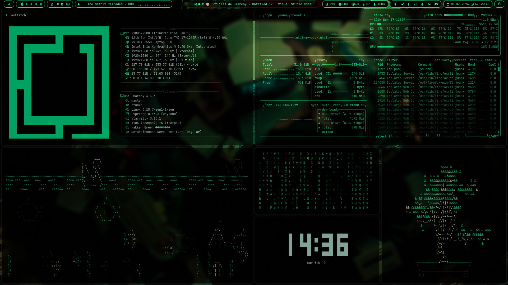

# Matrix Hacker

Tema visual moderno y minimalista para **Omarchy (Wayland/Hyprland)**,
inspirado en la estética Matrix: negro profundo, verde vibrante y una
experiencia enfocada en productividad y estilo hacker.

Diseñado para integrarse completamente con el ecosistema Omarchy,
incluyendo terminales, barra de estado, notificaciones, editor y prompt.

------------------------------------------------------------------------

## 📦 Requisitos

-   Arch Linux\
-   Omarchy → https://omarchy.org/

------------------------------------------------------------------------

## 🚀 Instalación

Ejecuta:

``` bash
omarchy-theme-install https://github.com/juanitosobarzo/omarchy-matrix-hacker-theme
```

Luego reinicia tu sesión o Hyprland para aplicar completamente el tema.

------------------------------------------------------------------------

## ⚙️ Componentes Incluidos

Este tema personaliza:

-   Hyprland (gestor de ventanas)
-   Hyprlock (pantalla de bloqueo)
-   Waybar (barra de estado)
-   Walker (launcher)
-   Mako (notificaciones)
-   Alacritty
-   Kitty
-   Ghostty
-   Neovim
-   VSCode
-   Btop
-   Starship
-   Fondos personalizados

------------------------------------------------------------------------

## 🖥️ Configuración de Starship

Para usar el prompt incluido, exporta la variable de entorno:

``` bash
export STARSHIP_CONFIG="$HOME/.config/omarchy/themes/matrix-hacker/starship.toml"
```

Agrega esta línea a tu:

-   \~/.bashrc\
-   \~/.zshrc\
-   \~/.config/fish/config.fish

Luego reinicia tu terminal.

Más información sobre Starship:\
https://starship.rs/

------------------------------------------------------------------------

## 🧩 Estructura del Tema

    omarchy-matrix-hacker-theme/
    ├── alacritty.toml
    ├── backgrounds/
    │   └── fondo-neo-matrix.png
    ├── btop.theme
    ├── ghostty.conf
    ├── hyprland.conf
    ├── hyprlock.conf
    ├── kitty.conf
    ├── kitty-matrix-hacker-theme.conf
    ├── looknfeel.conf
    ├── mako.ini
    ├── neovim.lua
    ├── preview.png
    ├── README.md
    ├── starship.toml
    ├── vscode.json
    ├── walker.css
    └── waybar.css

------------------------------------------------------------------------

## 🔧 Personalización

### Transparencia en Hyprland

Para ajustar opacidad de aplicaciones, edita `hyprland.conf`:

``` bash
windowrulev2 = opacity 0.90 0.90,class:^(nombre-app)$
```

Valores más bajos = más transparencia\
Valores más altos = menos transparencia

------------------------------------------------------------------------

### Modificar Configuraciones

Puedes editar directamente los archivos correspondientes:

-   waybar.css
-   walker.css
-   alacritty.toml
-   kitty.conf
-   ghostty.conf
-   btop.theme
-   neovim.lua
-   starship.toml
-   vscode.json

------------------------------------------------------------------------

## 🛠️ Solución de Problemas

### El blur no funciona

-   Verifica que tu GPU tenga aceleración habilitada.
-   Revisa que las optimizaciones estén activas en `hyprland.conf`.

### La transparencia no se aplica

-   Confirma el nombre correcto de la clase con:

    ``` bash
    hyprctl clients
    ```

-   Reinicia Hyprland después de modificar reglas.

### Problemas de rendimiento

-   Reduce el tamaño o número de pases del blur.
-   Desactiva animaciones si tu hardware es limitado.
-   Monitorea recursos con `btop`.

------------------------------------------------------------------------

## 🖼️ Preview



------------------------------------------------------------------------

## 🧠 Notas

-   Diseñado específicamente para el ecosistema Omarchy.
-   Puede adaptarse a entornos Wayland con Hyprland.
-   Incluye configuración adicional para Kitty y Starship (no vienen por
    defecto en Omarchy).

------------------------------------------------------------------------

## 📄 Disclaimer

Las imágenes fueron generadas con asistencia de IA.\
Los archivos fueron modificados y ajustados manualmente para su
integración en Omarchy.

------------------------------------------------------------------------

## 💚 Matrix Hacker

Un entorno limpio, oscuro y minimalista con esencia hacker.
